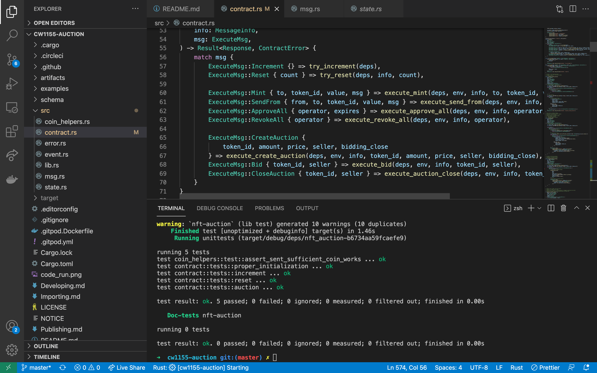

# nft-auction

## Auction API
```
// CW1155 NFT CONTRACT
ExecuteMsg::Mint { to, token_id, value, msg } => execute_mint(deps, env, info, to, token_id, value, msg),
ExecuteMsg::SendFrom { from, to, token_id, value, msg } => execute_send_from(deps, env, info, from, to, token_id, value, msg),
ExecuteMsg::ApproveAll { operator, expires } => execute_approve_all(deps, env, info, operator, expires),
ExecuteMsg::RevokeAll { operator } => execute_revoke_all(deps, env, info, operator),
QueryMsg::Balance { owner, token_id }
QueryMsg::IsApprovedForAll { owner, operator }

// AUCTION CONTRACT
ExecuteMsg::CreateAuction {
  token_id, amount, price, seller, bidding_close
} => execute_create_auction(deps, env, info, token_id, amount, price, seller, bidding_close),
ExecuteMsg::Bid { token_id, seller } => execute_bid(deps, env, info, token_id, seller),
ExecuteMsg::CloseAuction { token_id, seller } => execute_auction_close(deps, env, info, token_id, seller),
QueryMsg::Auction { seller, token_id }

// TEST COUNTER
ExecuteMsg::Increment {} => try_increment(deps),
ExecuteMsg::Reset { count } => try_reset(deps, info, count),
QueryMsg::GetCount {} => to_binary(&query_count(deps)?),
```

## Auction Architecture
```
mapping (&str => Auction) public tokenIdToAuction;
struct Auction {
  address seller;
  address highestBidder;
  uint128 price;
  Expiration biddingClose;
}
```
<p align="center">
  
</p>


## cw1155 auction implementation and terrad calls
```
cargo wasm
cargo test
cargo run-script optimize

// Deploy Contract
terrad tx wasm store artifacts/nft_auction.wasm --from test1 --chain-id=localterra --gas=auto --fees=100000uluna --broadcast-mode=block

// Initialize Contract
terrad tx wasm instantiate 33 '{"count":0,"minter":"terra1dcegyrekltswvyy0xy69ydgxn9x8x32zdtapd8"}' --from test1 --chain-id=localterra --fees=10000uluna --gas=auto --broadcast-mode=block

// Execute Reset
terrad tx wasm execute terra12f64q4lnvzr7ewjj7mdxvq0v0x7ktce3tsddx7 '{"reset":{"count":5}}' --from test1 --chain-id=localterra --fees=1000000uluna --gas=auto --broadcast-mode=block

// Execute Create Auction
terrad tx wasm execute terra12f64q4lnvzr7ewjj7mdxvq0v0x7ktce3tsddx7 '{"create_auction":{"token_id":"ID1","amount":"100","price":{"amount":"100","denom":"uluna"},"seller":"terra1dcegyrekltswvyy0xy69ydgxn9x8x32zdtapd8","bidding_close":{"at_height":123123}}}' --from test1 --chain-id=localterra --fees=1000000uluna --gas=auto --broadcast-mode=block

// Execute Bid
terrad tx wasm execute terra12f64q4lnvzr7ewjj7mdxvq0v0x7ktce3tsddx7 '{"bid":{"token_id":"ID1","seller":"terra1dcegyrekltswvyy0xy69ydgxn9x8x32zdtapd8"}}' --from test1 --chain-id=localterra --fees=1000000000000uluna --gas=auto --broadcast-mode=block

// Execute Close Auction
terrad tx wasm execute terra12f64q4lnvzr7ewjj7mdxvq0v0x7ktce3tsddx7 '{"close_auction":{"token_id":"ID1","seller":"terra1dcegyrekltswvyy0xy69ydgxn9x8x32zdtapd8"}}' --from test1 --chain-id=localterra --fees=1000000uluna --gas=auto --broadcast-mode=block

// Execute Mint
terrad tx wasm execute terra12f64q4lnvzr7ewjj7mdxvq0v0x7ktce3tsddx7 '{"mint":{"to":"terra1dcegyrekltswvyy0xy69ydgxn9x8x32zdtapd8","token_id":"ID1","value":"10001"}}' --from test1 --chain-id=localterra --fees=1000000uluna --gas=auto --broadcast-mode=block

// Execute SendFrom
terrad tx wasm execute terra12f64q4lnvzr7ewjj7mdxvq0v0x7ktce3tsddx7 '{"send_from":{"from":"terra1dcegyrekltswvyy0xy69ydgxn9x8x32zdtapd8","to":"terra1dcegyrekltswvyy0xy69ydgxn9x8x32zdtapd8","token_id":"ID1","value":"11"}}' --from test1 --chain-id=localterra --fees=1000000uluna --gas=auto --broadcast-mode=block

// Execute Revoke All
terrad tx wasm execute terra12f64q4lnvzr7ewjj7mdxvq0v0x7ktce3tsddx7 '{"revoke_all":{"operator":"terra1dcegyrekltswvyy0xy69ydgxn9x8x32zdtapd8"}}' --from test1 --chain-id=localterra --fees=1000000uluna --gas=auto --broadcast-mode=block

// Execute Approve All
terrad tx wasm execute terra12f64q4lnvzr7ewjj7mdxvq0v0x7ktce3tsddx7 '{"approve_all":{"operator":"terra1dcegyrekltswvyy0xy69ydgxn9x8x32zdtapd8","expires":{"at_height":123123}}}' --from test1 --chain-id=localterra --fees=1000000uluna --gas=auto --broadcast-mode=block

// Query Count
terrad query wasm contract-store terra12f64q4lnvzr7ewjj7mdxvq0v0x7ktce3tsddx7 '{"get_count":{}}'

// Query Balance
terrad query wasm contract-store terra12f64q4lnvzr7ewjj7mdxvq0v0x7ktce3tsddx7 '{"balance":{"owner":"terra1dcegyrekltswvyy0xy69ydgxn9x8x32zdtapd8","token_id":"ID1"}}'

// Query Is Approved For All
terrad query wasm contract-store terra12f64q4lnvzr7ewjj7mdxvq0v0x7ktce3tsddx7 '{"is_approved_for_all":{"owner":"terra1dcegyrekltswvyy0xy69ydgxn9x8x32zdtapd8","operator":"terra1dcegyrekltswvyy0xy69ydgxn9x8x32zdtapd8"}}'

// Query Auction
terrad query wasm contract-store terra12f64q4lnvzr7ewjj7mdxvq0v0x7ktce3tsddx7 '{"auction":{"seller":"terra1dcegyrekltswvyy0xy69ydgxn9x8x32zdtapd8","token_id":"ID1"}}'
```# terra-nft-auction
